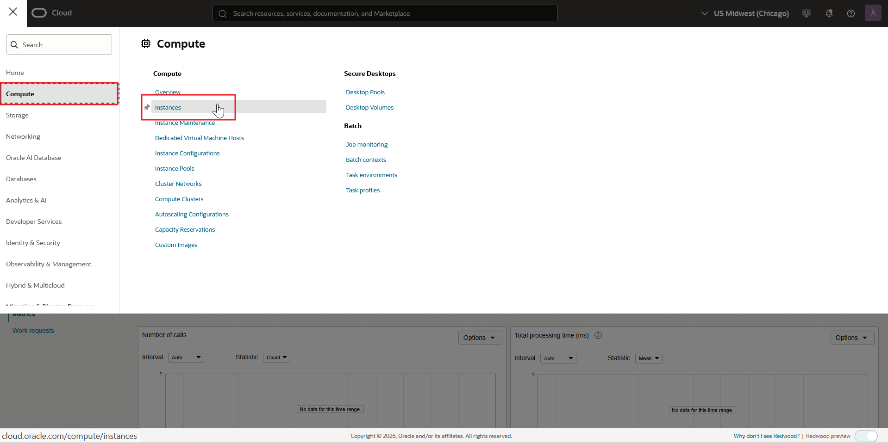
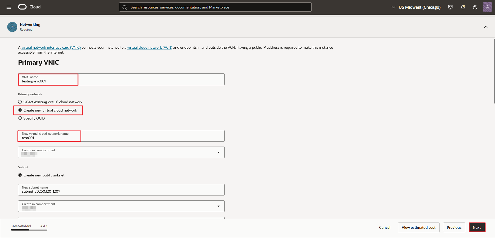
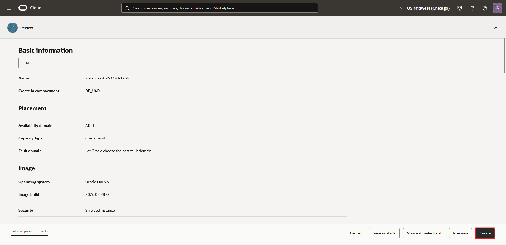
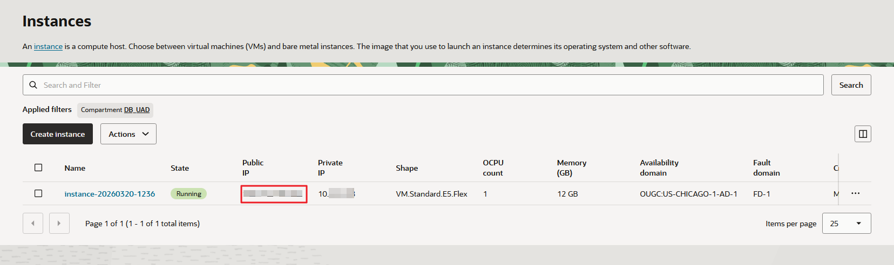

# Create a Compute Instance

## Introduction  

In this lab, you will learn more about Select AI for Python.


This lab establishes the foundation for Select AI for Python.

Estimated Time: 5 minutes

### Objectives

In this lab, you will:

* Select AI for Python
* Select AI for Python

### Prerequisites

This lab requires completion of the previous labs in the **Contents** menu on the left.


## Task 1: Select AI for Python

To enable Select AI for Python:


Select AI for Python is enabled for this database instance.

## Task 2: Generate SSH Keys with PuTTYgen

In this task, you generate the SSH key pair that you will use to connect to the OCI Compute instance.

1. Open **PuTTYgen** on your local machine.

2. Select the radio button for **EdDSA** and confirm that **Ed25519** is selected by default.

3. Click **Generate**.

4. Move your mouse in the blank area to provide entropy for the key generation process.

5. Save the private key as a `.ppk` file. You can set an optional passphrase.

6. Copy the public key text and save it for later use in the OCI Console.

    The expected output should look like:

    ```text
    Public key for pasting into OpenSSH authorized_keys file:
    ssh-ed25519 AAA...
    ```

## Task 3: Create an OCI Compute Instance

In this task, you create the OCI Compute instance that will host the OCI CLI, Python environment, OCI ADK, and sample Python script.

1. In the OCI Console, open the navigation menu, click **Compute**, and then click **Instances**.
   

2. Click **Create instance**.

3. In **Basic Information**, enter a name for the instance and select your compartment.
   

4. Accept the default values and click **Next** until you reach the **Networking** screen.

5. Under **Primary VNIC**, enter a value in the **VNIC name** field.
   

6. Select **Create new virtual cloud network**.

7. Enter a value in the **New virtual cloud network name** field and select your compartment.

8. Under **Subnet**, keep **Create new public subnet** selected.

9. Enter a value in the **New subnet name** field and confirm the compartment selection.

10. In the **Add SSH keys** section, select **Paste public key** and paste the public key you generated with PuTTYgen.

11. Continue through the remaining screens and accept the default values, review the details, and click **Create**.
    

12. Wait until the instance state changes to **Running**, and then copy the public IP address.
    

13. In the OCI Console, click the profile icon, open **User settings**, and copy the **User OCID**.

14. In the OCI Console, click the profile icon, click **Tenancy**, and copy the **Tenancy OCID**.

    The expected output should look like:

    ```text
    User OCID: ocid1.user.oc1..aaaaaaaaryd...
    Tenancy OCID: ocid1.tenancy.oc1..aaaa..
    ```

    >Note: You will use these values during the OCI CLI setup


## Learn More

* [Using Oracle Autonomous AI Database Serverless](https://docs.oracle.com/en/cloud/paas/autonomous-database/serverless/adbsb/select-ai-py.html)
* [Oracle Autonomous AI Database MCP Server Documentation](https://docs.oracle.com/en/cloud/paas/autonomous-database/serverless/adbsb/mcp-server.html#GUID-22D738E1-BC06-47F0-9684-CD698DD8C492)


## Acknowledgements

* **Author:** 
* **Contributors:** 
<!--* **Last Updated By/Date:** Sarika Surampudi, August 2025
-->


Copyright (c) 2026 Oracle Corporation.

Permission is granted to copy, distribute and/or modify this document
under the terms of the GNU Free Documentation License, Version 1.3
or any later version published by the Free Software Foundation;
with no Invariant Sections, no Front-Cover Texts, and no Back-Cover Texts.
A copy of the license is included in the section entitled [GNU Free Documentation License](https://oracle-livelabs.github.io/adb/shared/adb-15-minutes/introduction/files/gnu-free-documentation-license.txt)
